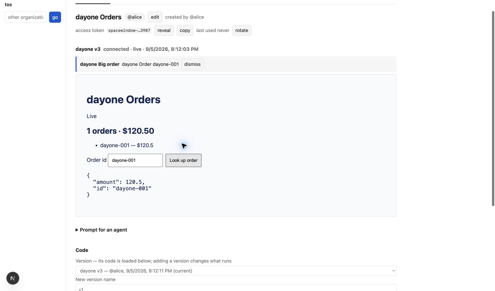
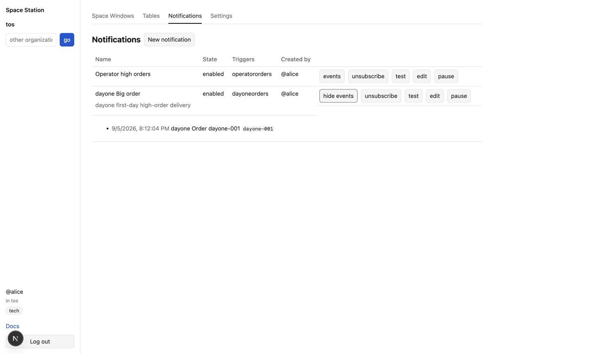
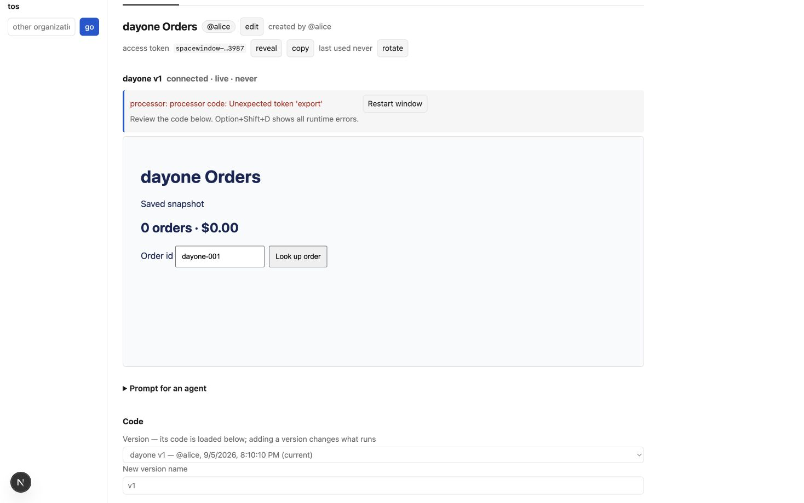

# First-day user acceptance — 2026-09-05

Independent exploratory use of the running local app in Chrome as Alice, organization `tos`. This was a step-by-step UI walkthrough using observed controls, with documented CLI commands for sending records and checking the created API key. No automated browser script or product source audit was used.

The main first-day journey passed after one runtime bug was fixed: sign in → create table → publish a window → send records → see live data → call a tool → receive a notification and signed webhook.

| Journey | Observed result |
| --- | --- |
| Sign in | Entered `tos`, continued to local IAM, chose Alice, landed on Tables with `@alice` and `tech`. |
| Create table | Created `dayoneorders`; key shown once, with a copy control and **Send your first records** documentation link. The link opened the getting-started page in a new tab. |
| Create/publish window | Created `dayone Orders`, pasted processor and renderer, published named versions. The prompt included the correct org, table, and window id. |
| Live records | First record produced `1 orders · $120.50`; later paused-alert record updated the still-running board to `2 orders · $370.50`. Tables ultimately showed three records and watermark 3. |
| Renderer tool | **Look up order** called the published `order_detail` tool and returned `{amount:120.5,id:"dayone-001"}`. |
| Notifications | Created `dayone Big order` from the JSON dialog. Alice received a live message in the window; **events** displayed its timestamp, text, and dedup key. |
| Edit | Changed the notification description; saved value appeared in its row. |
| Pause/dry-run/resume | Paused it; sent `dayone-paused` for 250. Board updated, but no webhook was delivered. **test** returned that candidate without delivery. Enabled it; sent `dayone-002` for 300; delivery resumed. |
| Subscribe | Unsubscribe changed the button to **subscribe**; subscribing again restored the subscription. |
| Org webhook | Created a local development webhook through Settings. Backend tester independently verified exact payload and HMAC signatures for `dayone-001` and `dayone-002`, and the absence of `dayone-paused`. |
| API key | Created a key with tables and notifications scopes through Settings; used it successfully with the documented CLI to read `dayoneorders`. |
| Access | Added `@bob` to the table access editor and saved. Independent CLI read with the created API key confirmed `access:["@alice","@bob"]`. |

One blocking bug was discovered and fixed during this walkthrough. Valid processor code with `; export default defineProcessor(...)` on the same line published but failed at runtime with `Unexpected token 'export'`. A newline before the export worked. After the runtime owner fixed it, a full page reload and publication of the exact original inline-export code as `dayone v3` succeeded; live rendering and the tool call both passed. The failing and passing screenshots are below.

Remaining manual UI coverage limitation: clicking **rotate key** opened a native browser confirmation, and the browser control tool timed out while accepting it. One recovery also timed out, so the browser rotation outcome, dev-panel shortcut, organization switching, and logout were not verified by this tester. This is not evidence of an application failure. Root/operator separately verified key rotation through the CLI. Root was informed that all test mutations were finished before its clean-restart check.

Small usability observations, without adding frontend scope: the documented record command provides a direct path from table creation to first data; the notification JSON template already chooses an available table and current actor. The empty dry-run originally displayed raw `[]`, and the renderer iframe lacked a title. Root addressed these with “No new matching rows.” and an accessible iframe title.

Root's follow-up after a clean stop/start verified the dev-panel shortcut, successful logout,
sign-in as Alice in `acme` with `sales` tags and an empty Tables screen, then switching back to
`tos` with `tech` tags and all five Alice-visible demo records preserved. Browser key rotation
remains the sole UI step not completed through the browser tool; its actual key behavior passed
through the CLI.

Retained local fixtures: table `dayoneorders`; window `13adc9d2-4cd0-44b6-8f97-86e6463cde71` (`dayone Orders`, current `dayone v3`); notification `dayone Big order`; webhook `4d8c9730-87ce-4187-8b7b-6522db052cea`; API key id `af903ed1-c8d2-411b-8601-c8bc510357dd`. Only generated test secrets were saved to private files under `/tmp`; no credentials are in this report.

